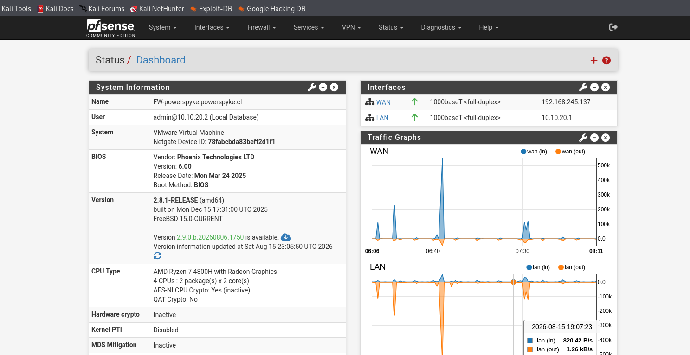

# Laboratorio de Red y Seguridad Perimetral con pfSense

Implementación y configuración de un firewall perimetral pfSense en un entorno totalmente virtualizado (VMware Workstation) para la segmentación de red, administración de tráfico perimetral, políticas de seguridad y filtrado de contenido.

## Arquitectura de Red y Virtualización

El laboratorio está diseñado aislando las interfaces de red dentro del hipervisor para forzar que todo el tráfico transite y sea auditado a través del firewall pfSense:

- **Hypervisor:** VMware Workstation
- **Interfaz WAN (`192.168.245.137`):** Configurada en modo *NAT / DHCP* simulando la conexión perimetral externa.
- **Interfaz LAN (`10.10.20.1/24`):** Configurada en modo *Red Interna (Internal Network)* conectada a una máquina cliente (Kali Linux `10.10.20.2`).

## Configuraciones e Implementaciones

- **Políticas y Reglas de Firewall:**
  - Reglas de filtrado en la interfaz LAN para control de acceso, restricción del puerto HTTP (80) y políticas de bloqueo ICMP.
  - Regla *Anti-Lockout* activa para garantizar el acceso seguro a la interfaz de administración.
- **Servicios de Red:**
  - **DHCP Server & DNS Resolver (Unbound):** Asignación dinámica de direccionamiento y resolución segura de nombres.
- **Filtrado de Contenido y Reputación DNS (pfBlockerNG-devel / DNSBL):**
  - Implementación de listas de bloqueo DNSBL para la restricción de categorías de contenido no deseado y dominios maliciosos.
  - Redirección a pantalla de bloqueo personalizada para el cliente LAN (`10.10.20.2`).
- **Paquetes de Seguridad e Inspección:**
  - Instalación y despliegue de paquetes de seguridad perimetral como *pfBlockerNG*, *Suricata*, *Snort* y *ntopng*.

## Evidencias de Configuración

### Dashboard General de pfSense

### Consola de la VM (VMware) e Interfaces

### Reglas de Firewall (Interfaz LAN)

### Bloqueo de Contenido en Acción (pfBlockerNG / DNSBL)

## Pruebas y Validación
- Validación de conectividad y asignación de parámetros IP en la red LAN.
- Verificación de políticas de seguridad mediante denegación de tráfico no autorizado.
- Comprobación en tiempo real del bloqueo de dominios no permitidos mediante DNSBL.

## Descargo de Responsabilidad
Este entorno fue desplegado exclusivamente con fines académicos, de prueba y auditoría en laboratorios controlados.
